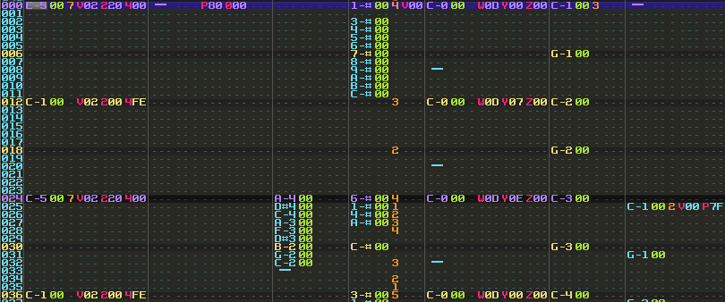
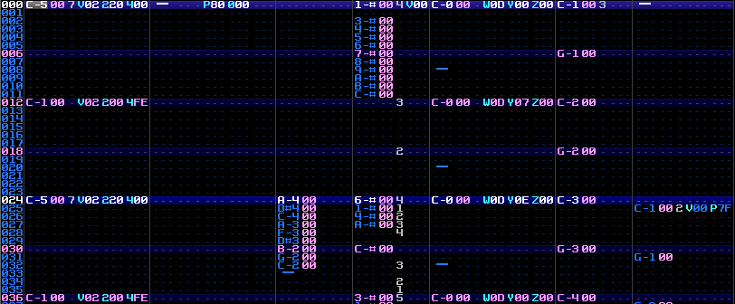
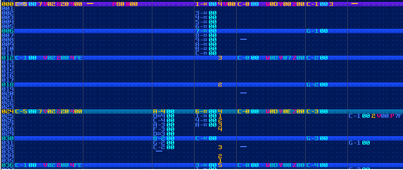

# famitracker-palettes
Palettes for use with <a href="https://github.com/jimbo1qaz/j0CC-FamiTracker/releases" target="_blank">j0CC-FamiTracker</a> 

[Chilly Blue](https://github.com/psgcabal/lsdpals/raw/master/lsdpal/Chilly%20Blue.txt) (Recoherent)  
[Grape Soda](https://github.com/psgcabal/lsdpals/raw/master/lsdpal/Grape%20Soda.txt) (Aquellex)  
[Lindenmorsen's Cage](https://github.com/psgcabal/lsdpals/raw/master/lsdpal/Lindenmorsen's%20Cage.txt) (Aquellex)  
[Mazda Blue](https://github.com/psgcabal/lsdpals/raw/master/lsdpal/Mazda%20Blue.txt) (Dimeback)  
[Monokai](https://github.com/psgcabal/lsdpals/raw/master/lsdpal/Monokai.txt) (Aquellex)  
[Night Sky](https://github.com/psgcabal/lsdpals/raw/master/lsdpal/Deathro.txt) (DB_Drgn_)  
[Pseudo-Cobalt](https://github.com/psgcabal/lsdpals/raw/master/lsdpal/Pseudo-Cobalt.txt) (Aquellex)  
[Strawberry Candy](https://github.com/psgcabal/lsdpals/raw/master/lsdpal/Strawberry%20Candy.txt) (Dimeback)  
